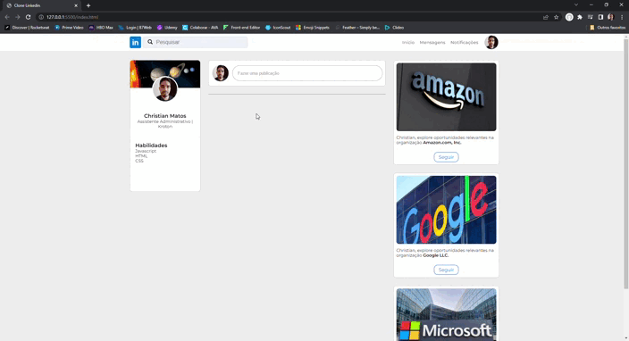

# Clone Linked In

Projeto desenvolvido para estudos.

## Funcionalidades

- Realizar uma postagem na página
- Editar uma postagem publicada
- Excluir um postagem publicada

## Demonstração

    

## Link

Para visuailzar o projeto, basta acessar o link: https://christiancmatos.github.io/Clone-LinkedIn/

## Observações

- O Google classificou como site fraudulento (não sei porque). Para poder visualizar o projeto pelo Chrome, é necessário clicar em 'Saiba Mais' e depois em 'acessar este site não seguro'.

- No Edge e no Firefox o acesso está normal.
